# 软件介绍及截图
****
## 介绍
***本软件是为了完成学校的一个作业，作为安卓初学者，软件有很多不足的地方。
使用eclipse开发完成。基于百度地图SDK。数据库为mysql。
这是软件的客户端部分。***

## 登录（学生端，老师端）
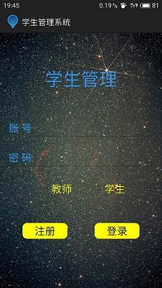   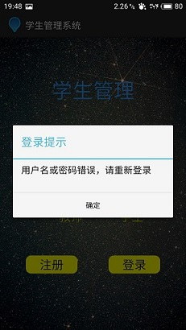 

## 注册
### 教师端
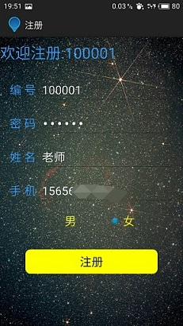
### 学生端
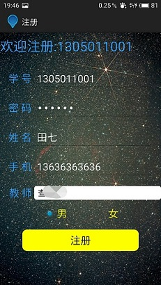  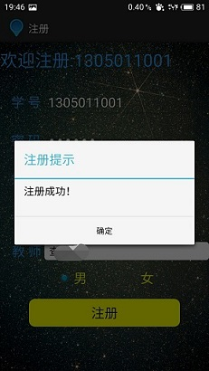

##地图显示
### 教师端
 
### 学生端
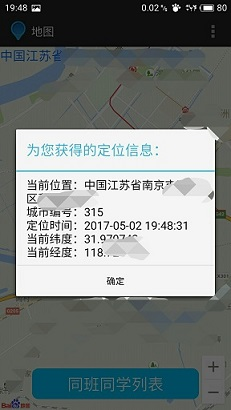  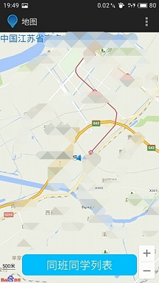  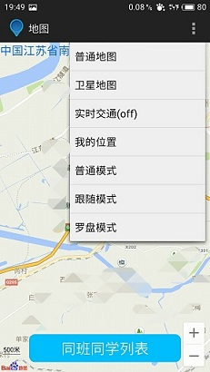

## 学生端：同学信息列表
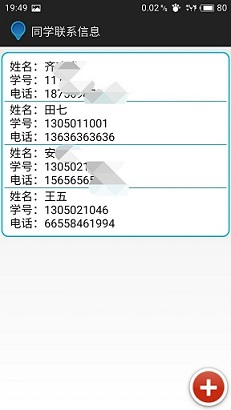 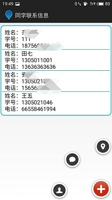

## 教师端：学生位置信息列表
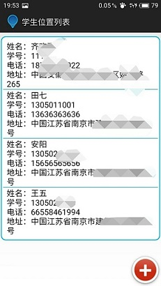 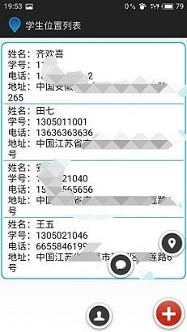

## 教师端：发布通知
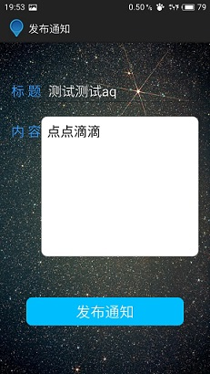 

## 学生端：查看通知
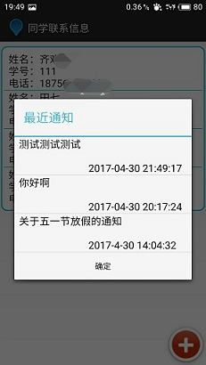 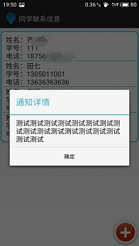

## 退出登录
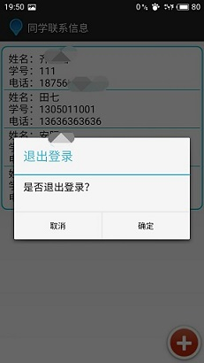
